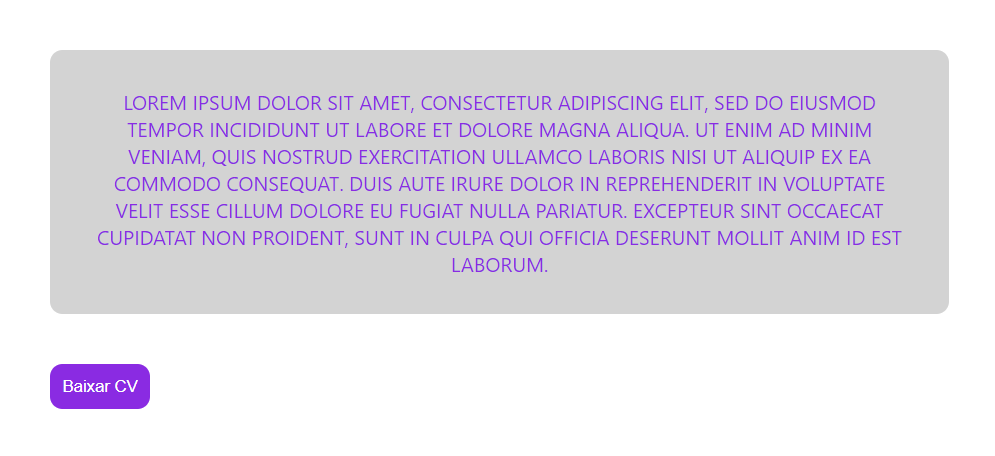

<h1 align="center"> Desafio Base React  </h1>

Esse projeto é um desafio proposto pelo curso DevQuest para aprimorar os meus conhecimentos nas tecnologias WEB.  

  <a href="#-visão-geral">Visão Geral</a>&nbsp;&nbsp;&nbsp;|&nbsp;&nbsp;&nbsp;
  <a href="#-projeto">Projeto</a>&nbsp;&nbsp;&nbsp;|&nbsp;&nbsp;&nbsp;
  <a href="#-tecnologias">Tecnologias</a>&nbsp;&nbsp;&nbsp;

 

## 👀 Visão Geral

 

## 💻 Projeto

Nesse projeto foi executado dois desafios utilizando React:

- Desafio 1
    - Criar componente que colore e transforma um texto para maiúsculo (uppercase) utilizando JS.

- Desafio 2
    - Mostrar mensagem com a label do botão quando ele for clicado.

 

---
[Visite o projeto online](https://desafio-base-react.vercel.app/)

 

## 🚀 Tecnologias

Esse projeto foi desenvolvido com as seguintes tecnologias:

- HTML
- CSS
- JavaScript
- React

